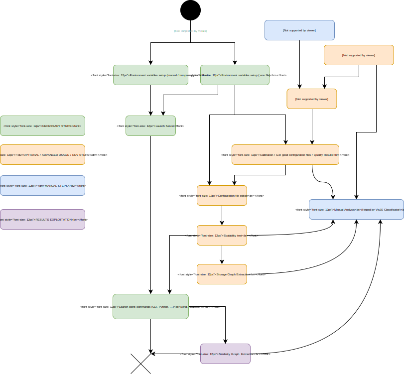
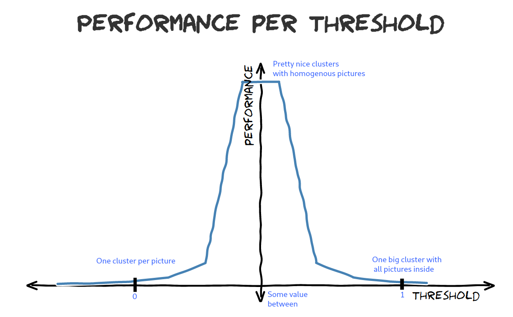
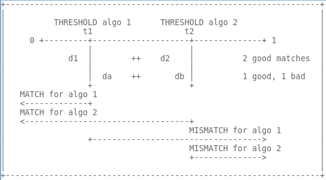
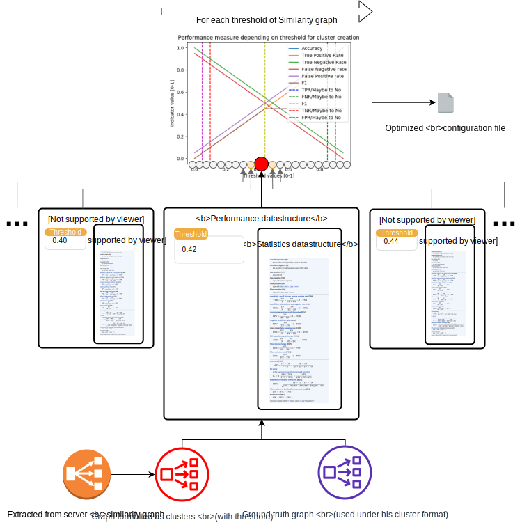
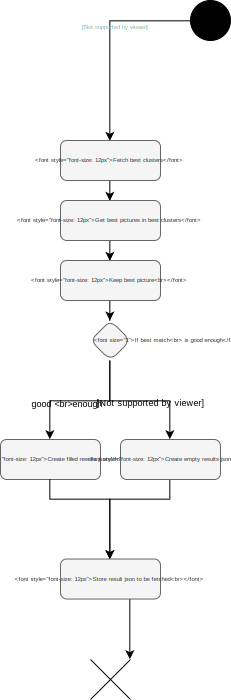
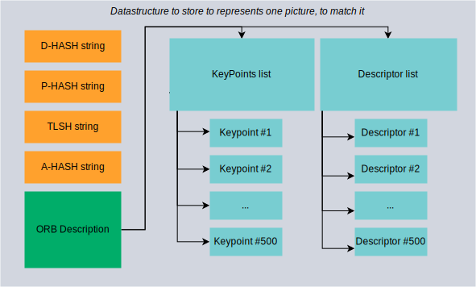
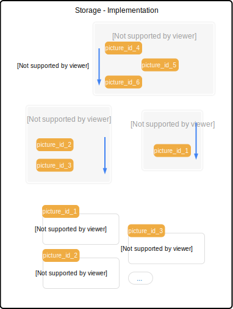
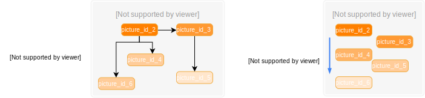
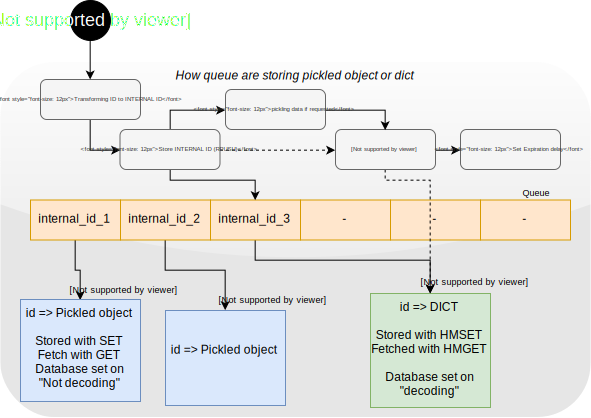
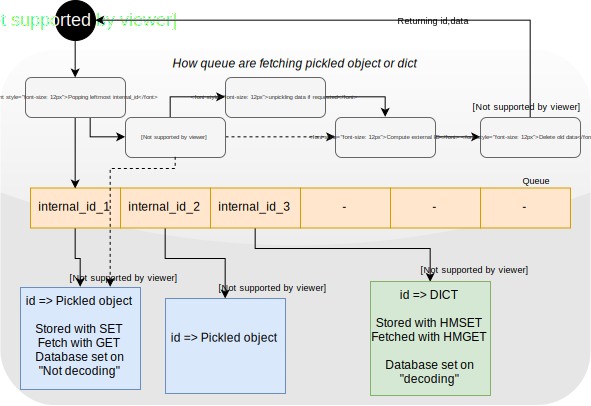

# Douglas-Quaid Project

[](https://app.codacy.com/app/zettacircl/douglas-quaid?utm_source=github.com&utm_medium=referral&utm_content=Vincent-CIRCL/douglas-quaid&utm_campaign=Badge_Grade_Dashboard)


Open source software for image correlation, distance and analysis.
Strongly related to : [Carl-Hauser](https://github.com/CIRCL/carl-hauser) 

## Problem statement (@CIRCL)


A lot of information collected or processed by CIRCL are related to images (at large from photos, screenshots of website or screenshots of sandboxes). The datasets become larger and analysts need to classify, search and correlate throught all the images. 

## Target

Building a generic library which can establish correlation between pictures, which can be easily integrated in [AIL](https://github.com/CIRCL/AIL-framework) and [MISP](https://github.com/MISP/MISP) (at least). Including a quick-lookup mechanism for correlation (similar to [ssdc](https://github.com/bwall/ssdc/blob/master/ssdc) techniques)

Three main applications are envisioned : 
-   Match new screenshots to a known baseline. E.g. : Matching screenshots from phishing-like website to known legitimate wesite.
-   Match pictures or objects of pictures together. E.g : AIL; crawled websites (mainly Tor hidden services) from interpreted screenshot, 
-   Match pictures or objects of pictures together. E.g : crawled websites or image extraction from DOM (ex : picture matching and inference if there is no text related to the picture.)

Other picture sources : 
-   lookyloo screenshots from phishing-like - mix and non validated dataset
-   screenshots from sandboxed malware analysis

## API Target

Now : 
-   Provide a simple API : add pictures to the database, perform a picture-request 
-   Provide an algorithm-blind API : user should have nearly no choice for his requests. Parameters are server-side only.

Later : 
-   Handling tags with storing picture : retrieve tags. This may be extended with any data.

## Getting Started

-   Documentation of core components : [MarkDown - NOT UPDATED](./SOTA/Core_doc.md) | [PDF version](./SOTA/Core_doc.pdf)

### Questions

-   **_Can the library say there is no match or will it always gives a "top N" matching pictures ?_**

For our automated usecases, e.g. MISP, we need clear "answer" from the library, to allow automation. 
The final goal of this library is to map all matches into one of the three categories : Accepted pictures, To-review pictures, and Rejected pictures.
Therefore, the goal will be to reduce the "to review" category to diminish needed human labor to edgy cases only.

-   **_What is this library about ? Similarity search (global picture to picture matching) ? Object search (object detection in scene, followed by object search among other pictures) ? ..._**

For a first iteration, we are focusing on picture-to-picture matching. Therefore, given a bunch of already known pictures, we want to know which pictures - if any - are close to a request picture. This is similar to an inverted-search engine.

The library is mainly intended to work with screenshots like pictures. However, it may be tweaked to provide similar services in a different context.
However, matching principles are quite similar, and the extension may be trivial.

-   **_Can I use the library in the current state for production ?_**

Yes. However, be aware that the current state of the library is "beta". Therefore, stability and performances may not be as high as you would expect for an industry-standard image-matching tool.
You can import the client API in your own Python software and perfom API calls to push picture/request search/pull results.

See [Client Example](https://github.com/CIRCL/douglas-quaid/blob/master/carlhauser_client/core.py) if you want to start.

### Installing

For server and client, installation and launch : See [detailed installation instruction](./installation_info.md)  

### TLDR ; I want it to work ! 
Please follow 'detailed installation instruction' if you meet any issue.

[](https://www.youtube.com/watch?v=T-8rsVPIixc)

###### Installation

```bash
pipenv install                              # Create a virtual environment with needed dependencies
pipenv shell                                # Get into the virtual environment
chmod +x ./tlsh_install.sh                  # Make the TLSH script runnable
sudo ./tlsh_install.sh                      # Install TLSH
sudo apt-get install redis                  # Install redis
source ./scripts/export_env_variables.sh    # Setup environment variable automatically
```

###### Server side launch

```bash
cd ./carlhauser_server
pipenv run python3 ./instance_handler.py   
```

###### Client side launch
All approaches are equivalents. Pick the one that suits you the most.

```bash
cd ./carlhauser_client
pipenv run python3 ./client_instance_example.py
```

or via CLI 

```bash
pipenv shell

# Upload all pictures of folder "Pictures_folder" and create a mapping (file_name => server_side_id)
python3 ./API/cli.py upload -p ./../datasets/Pictures_folder -o ./mapping.json

# Request similar picture of one of your pictures. You can specify the mapping file to get "real names" of pictures (client-side name).
python3 ./API/cli.py request -p ./../datasets/Other_folder/my_picture.png -o ./similar_pics.json -m ./mapping.json

# Make a dump of the database as is of the server. You can specify the mapping file to get "real names" of pictures (client-side name). 
python3 ./API/cli.py dump -o ./dbdumpfile.json -m ./mapping.json -c
```

or from your own custom python file

```python
from common.environment_variable import get_homedir
from carlhauser_client.API.simple_api import Simple_API

# Generate the API access point link to the hardcoded server
cert = (get_homedir() / "carlhauser_client" / "cert.pem").resolve()
api = Simple_API(url='https://localhost:5000/', certificate_path=cert)

# Each call to API return 2 values. 
# First value = success boolean, Second value = json response of the server

# Ping server (sanity check, not technicaly required) 
api.ping_server()

# perform uploads
api.add_one_picture(get_homedir() / "datasets" / "simple_pictures" / "image.jpg")
# (...)

# Request a picture matches
success, request_id = api.request_similar(get_homedir() / "datasets" / "simple_pictures" / "image.bmp")
# (...)

# Wait a bit
api.poll_until_result_ready(request_id, max_time=60)

# Retrieve results of the previous request (print on screen)
success, results = api.get_results(request_id)

# Triggers a DB export of the server as-is, to be displayed with visjsclassificator. Dump to a file on server side too.
success, graph = api.export_db_server()
```

or from extended API
```python
from common.environment_variable import get_homedir
from carlhauser_client.API.extended_api import Extended_API

# Generate the API access point link to the hardcoded server
cert = (get_homedir() / "carlhauser_client" / "cert.pem").resolve()
api = Extended_API(url='https://localhost:5000/', certificate_path=cert)

# Ping server (sanity check, not technicaly required) 
api.ping_server()

# perform uploads
api.add_many_pictures_and_wait_global(get_homedir() / "datasets" / "simple_pictures")

# Retrieve results of the previous request (print on screen)
list_answers, nb_pics = api.request_many_pictures_and_wait_global(get_homedir() / "datasets" / "simple_pictures")

# Triggers a DB export of the server as-is, to be displayed with visjsclassificator. Server-side only operation.
success, graph  = api.export_db_server()
```

or with even less call
```python
from common.environment_variable import get_homedir
from carlhauser_client.API.extended_api import Extended_API

# Generate the API access point link to the hardcoded server
api = Extended_API.get_api()

# Ping server, and perform uploads
api.ping_server()

# Request a picture matches
list_answers = api.add_and_request_and_dump_pictures(get_homedir() / "datasets" / "simple_pictures")

# Triggers a DB export of the server as-is, to be displayed with visjsclassificator. Dump to a file on server side too.
graph = api.export_db_server()[1]
```

or with 2 liners
```python
from common.environment_variable import get_homedir
from carlhauser_client.API.extended_api import Extended_API

# Generate the API access point link to the hardcoded server
api = Extended_API.get_api()

# Request a picture matches
list_answers = api.add_and_request_and_dump_pictures(get_homedir() / "datasets" / "simple_pictures")
```
        

### Advanced usages

Setup environement variables with a .env file to prevent launchng environement variable setup before each launch.
```bash
PYTHONPATH="/home/user/Desktop/douglas-quaid"
CARLHAUSER_HOME='/home/user/Desktop/douglas-quaid'
```
        
At some point, you need a sample of your production dataset. A script is provided. Put in in the folder where your files are, and create a "SAMPLED" folder on level upper. Execute the script as many time as needed to sample random pictures from the folder to the SAMPLED folder.
```bash
cp ./douglas-quaid/script/sampler.sh ./dataset/you-fascinating-dataset/
mkdir ./dataset/SAMPLED
./dataset/you-fascinating-dataset/sampler.sh (as many times as needed)
```

You may want to visualize your results with VisJS-Classificator. You can install it with
```bash
git clone https://github.com/Vincent-CIRCL/visjs_classificator.git
npm install
npm install visjs-network
node server.js -i <Your folder of picture> -t /TMP -o ./TMP -j <optional json file to load>
```
                
If you need to create a ground truth file, install VisJSClassificator and cluster pictures following : 
```bash
# Dataset Ground truth (visjs) creation
node server.js -i ./../SAMPLED/ -t ./TMP -o ./TMP
# Cluster all pictures (even if alone in the cluster, with C)
```

You can launch a configuration calibraiton on your own dataset with your own ground truth file. Default settings are valid for screenshots (it seems at least). Be aware that the calibration only calibrate activated algorithms and copy the default configuration for the others.
```bash
# Douglas Quaid calibration from sampled dataset and ground truth

python3 ./threshold_calibrator.py from_cmd_args -s ./../../../SAMPLED -gt ./../../../SAMPLED_dict.json -d ./

python3 ./threshold_calibrator.py -s ./../../../SAMPLED/ -gt ./../../../SAMPLED_dict.json -d ./RESULTS/ from_cmd_args -AFPR 0.1 -AFNR 0.1

# Only for activated algorithms in configuration file ! 
```
        
After calibration, you have to manually copy values from one file to the configuration file used by the server. thresholds are the most important thing to copy.
```bash
# Transfer of configuration
Copy paste
```
        
You can extract the similarity graph (the graph of distances between added pictures) from Douglas-Quaid. It could be useful to load it into VisJS to have a broad overview of what the quality of the library is. You can provide a ground truth file to get a quality evaluation of the extract graph. The mapping file is the mapping of original names to uuid given by the server to pictures sent. It is created at adding time and needed for every other extraction if you want the original name to be displayed in output's files. (and so being able to load the pictures in VisJS). Loadable in VisJS.
```bash
# Similarity graph

# TODO : NO GROUND TRUTH ? 
python3 ./EvaluationTools/SimilarityGraphExtractor/similarity_graph_extractor.py -h
python3 ./EvaluationTools/SimilarityGraphExtractor/similarity_graph_extractor.py -s SRC -gt GT -d DEST

node server.js -i ./../SAMPLED -t ./TMP -o ./TMP -j ./../douglas-quaid/carlhauser_client/EvaluationTools/SimilarityGraphExtractor/distance_graph.json
node server.js -i ./../SAMPLED -t ./TMP -o ./TMP -j ./../douglas-quaid/carlhauser_client/EvaluationTools/SimilarityGraphExtractor/distance_graph_yes_maybe_no.json

```

For debugging purposes, you can extract the storage graph. It represents the way all pictures are stored in the database. Loadable in VisJS.
```bash
# Storage graph
python3 ./API/cli.py dump -o dbdumpfile.json -m ./mapping.json
```

You can also launch a scalability test, to see if the operations complexity of the library is linear, surlinear or sublinear. This may take quite some time to compute. Two version are available : one version that evaluates the library as-is (with configuration files) and the one showed in the next code-blocks, which iterates over threshold (between creating a new cluster or putting pictures in the same cluster, for storage only) to compute performances. The last argument is the number of threshold to test. More details in the configuration file in the same folder.
```bash
mkdir OUTPUT_SCALABILITY
python3 ./common/Scalability_evaluator/scalability_with_threshold_evaluator.py  -h
python3 ./common/Scalability_evaluator/scalability_with_threshold_evaluator.py -s ./../PHISHING-DATASET/ -d ./OUTPUT_SCALABILITY/ -n 10
```

If you messed up, you can reset the library : it will flush databases, kill workers, etc. If you hard-stopped the server or filled it with junk, launch this.
```bash
./scripts/wipe_databases.sh 
```

## Running the tests

Please be sure to download [tests files](https://github.com/Vincent-CIRCL/douglas-quaid-tests) before launching tests.
Tests are quite long to be performed, and you should do so only for devlopement purposes.

## Behind the scene

Current library is a step behind [Carl-Hauser](https://github.com/CIRCL/carl-hauser) (:wink:) for algorithms implementation, but uses :
-   ImageHash Algorithms (A-hash, P-hash, D-hash, W-hash ... )
-   TLSH
-   ORB

Performance (quality and time) is served by improvements and design choices on top of these algorithms.

## Configuration and Tweaking

#### What to do with the library


#### Must known

The library is storing pictures within clusters of somewhat-similar pictures.   
When a picture is added in the database or a request is made, algorithms perform a comparison of the picture with all "most central"/"most representative" picture(s) of each cluster.  
Therefore, instead of making a comparison of one pictures to all pictures of the database (`O(nb_picture_in_db)`), it compares the picture with all clusters (`O(nb_clusters)`).    
Depending on a threshold, the picture will be matched to a cluster (in fact, the representative picture of the cluster) or not. If the picture match a representative picture of a cluster, we compare the request picture with all pictures of this cluster.   
Therefore, instead of running `O(nb_picture_in_db)` comparisons, we run `O(nb_clusters+nb_matched_clusters*nb_pictures_in_each_cluster)`  
This improves performances by decreasing performed comparisons.

Tricky thing is the threshold which says "This picture is too distant, it must be in a new cluster" or "This picture is close enough and is in the same cluster":   
This threshold impacts on the performance of the library (time-wise) and less/not on the quality of match.  

<p  align="center" float="center">

<br/>
How you must understand this "new cluster threshold".
</p>

However, one consequence and must-known is : **this threshold should be set once and for all at server start.** All the performance-datastructures are built on top of it. It must be consistent between adding-time and request-time. Unexpected results will occur otherwise.   
Moreover you can't make a "wrong choice" for this threshold. At worst, it will be slow, but it will work.   

I repeat : 
<h3>

```diff
- MAX_DIST_FOR_NEW_CLUSTER threshold should be set once and for all at server start. -
```

</h3>

If the `threshold is 1` : all pictures will be in one big cluster, so the library will always match "this cluster" and so all pictures will be compared two-by-two. (Fallback to `O(nb_picture_in_db)`)     
If the `threshold is 0` : each pictures will be in its own cluster, so the library will compare all "head of clusters" and so all pictures will be compared two-by-two. (Fallback to `O(nb_picture_in_db)`)     
Anything in the middle will improve performance.    

Empirically, `0.2` was not a bad value. Evaluation algorithms are available if you want to get `True-Positive/False-Positive/True-Negative/False-Negative/Acc/F1` measures depending on this threshold.     
If you anyway want to change this threshold, you must stop the server, drop the redis database (delete `/Helpers/database_data/*`), start the server, and reupload all pictures.      

#### Parameters tweaking

The library has many parameters. To correctly configure the library for your own usecase, you may have to tweak these values. Therefore, you must understand them.  
Distance are normalized euclidian distance, which means **0 = totally similar, 1 = totally different**. 
 
Each algorithm computes distance between pictures. Each algorithm has it's own way to compute this distance, but all outputs a value within range  `[0-1]`. Example : A-HASH outputs a distance of `0.4` between picture A and B
Each algorithm computes a decision about two pictures comparison. Thresholds over its own distance calculation give a YES/MAYBE/NO decision.    Example : A-HASH outputs a decision `YES (it matches)` between picture A and B, because distance between picture A and B is `0.4`, which is less than the `maybe_threshold` of A-HASH. 

During two pictures comparison, configured algorithms are called. Each provides a distance and a decision.  
A merging algorithm do merge these distances and do merge these decisions.  
Distances can be merged with distinct approaches : 
-   Max of all distances;
-   Mean of all distances;
-   Min of all distances;
-   Harmonic mean;
-   Weighted mean of all distances, etc.   

Decisions can be merged with distinct approaches : 
-   Pareto rule (if 80% algorithms give the same decision, we output this decision);
-   Majority rule (most prevalent decision is returned);
-   Weighted majority;
-   Pyramidal (we check for high some algorithms, and if unsure, we check others).

#### Why decisions

<p  align="center" float="center">

</p>

Decisions are not a simple threshold over distance. If you consider two algorithms:
-   For algorithm A, a match is meaningful if the returned distance is below `0.25`. It is a mismatch if the distance if upper than `0.25`. 
-   For algorithm A, a match is meaningful if the returned distance is below `0.85`. It is a mismatch if the distance if upper than `0.85`. 

Consider two comparison : 
-   Algorithm A gives a distance of `0.2` (match for itself), algorithm B give a distance of `0.8` (match for itself).  
-   Algorithm B gives a distance of `0.7` (match for itself), algorithm A give a distance of `0.3` (mismatch for itself).
 
Min, max, mean (`0.5`) are similar in both cases. However, in first case, all algorithms considered it as a "match". In second case, only one algorithms considered it as a "mismatch". We do not even consider "gray zone" in this example, but only strict thresholds.  
This problem exists because each algorithm has its own "range of values" in which a match is a meaningful match. Normalization could have been a solution, but decisions seems more human-readable.     
It allows to launch more algorithms depending on the decision, too.     

That's why a "YES" or "MAYBE" decision can come after a "NO" decision in a distance-sorted list.

#### Performance optimization process

The API is simplistic and the complexity moved to the server side. The choice of algorithm parameters is difficult, but is solved by a calibration algorithm. 

The library therefore only needs:
-   a subset of the production dataset (for example, 20 to 40 images sampled from a complete dataset);
-   a "ground truth" file to define the ideal result expected;
-   the target rates of false positive/true positive, false negative/true negative (at least two of them).

The calibration algorithm will seek to optimize the internal parameters of Douglas-Quaid with these inputs. The main advantage is therefore the absence of obscure parameters (example: a threshold between 0 and 1) to be provided without knowledge of the internal functioning of the library.

<p  align="center" float="center">

</p>

Internally, the calibration algorithm will send pictures to the database, extract the similarity graph and evaluate this similarity graph in comparison of the ground truth clusterisation provided. As a comparision between a graph and a list of cluster of pictures is not trivial, we prune the graph (of distances) with a threshold. Then, we can convert the graph into clusters and compare clusters to ground truth clusters. This give us a bunch of metrics (True Positive rate, False Positive rate, etc.) for this specific threshold. We can then find the best threshold that optimize this or that metric (e.g. 10% and no more False positive, etc.). 
If the original graph had been generated from a configuration enabling only one algorithm, we then have extracted two thresholds for this specific algorithm. If more than one algorithm were activated, we then have two thresholds for the whole output of the library. This is not used and not relevant in our setting. So, the calibration algorithm extract only per-algorithm thresholds to build the future configuration file of the server.

### For Developers


More details are given in [Documentation PDF version](./SOTA/Core_doc.pdf)

<p  align="center" float="center">








</p>

You want to see how to add a new algorithm to the library ? 
Get a look at [this commit](https://github.com/CIRCL/douglas-quaid/commit/9942a004f87d79c0b7cecc177dd165de1f3514c4) or [this commit](https://github.com/CIRCL/douglas-quaid/commit/364898911d9171edaf6b8403427302ca528993a3). These should act as nice commits that show you what to add and where.

Roughly, steps are : 
-   Create a picture_YOUR_NEW_ALGO file that computes the features from one picture
-   Edit feature worker to call this new picture_X computation
-   Create a distance_YOUR_NEW_ALGO file that computes the distance between two set of features
-   Edit distance engine to call this new distance_X computation
-   Edit configuration files to store what you need/can be modified. If an option is obviously better than an other one, hardcode it and do not put it in configuration file.

## Deployment and Test procedure

Process to follow, after installation.

1. Launch calibration on a subset of your production data (40 to 100 pictures)
2. Launch server with calibrated options
3. Launch similarity graph extractor to send a bunch of production data in the server and to get an overview of the quality of matching
4. Vizualize with VisJS-Classificator the graph

```bash
python3 ./common/Calibrator/threshold_calibrator.py -s <filepath to subset of your prod data> -gt <filepath to ground truth file made with visjs classificator>.json -d <Output folder path where you want configuration to be saved> from_cmd_args -AFPR < Acceptable rate of false positive. e.g. 0.1> -AFNR < Acceptable rate of false negative. e.g. 0.1>

python3 ./carlhauser_server/instance_handler.py -fec <folderpath where config file saved>/calibrated_db_conf.json -distc <folderpath where config file saved>/dist_conf_calibrated.json

python3 ./carlhauser_client/EvaluationTools/SimilarityGraphExtractor/similarity_graph_extractor.py -s <folder path to your big dataset (500>)> -gt <Filepath to your ground truth file for this dataset, if you want it to be evaluated. Optional>.json -d <folder path to output graphe, etc.>

node server.js -i <folder path to your big dataset (500>)> -t <Path to a temporary folder, any one> -o <Path to an output folder, any one> -j <file path to the generated graph>/distance_graph.json
```

## Built With & Sources

-   [Original project structure source](http://www.kennethreitz.org/essays/repository-structure-and-python)
-   [Testing framework for algorithms](https://github.com/CIRCL/carl-hauser)
-   [Followed practice for logging](https://fangpenlin.com/posts/2012/08/26/good-logging-practice-in-python/)
-   [Text detector model source](https://github.com/argman/EAST)
-   [Built-for-the-occasion manual image classificator](https://github.com/Vincent-CIRCL/visjs_classificator)
-   [Bibliography](https://www.zotero.org/groups/2296751/carl-hauser/items)

## Contributing
PR are welcomed.
New issues are welcomed if you have ideas or usecase that could improve the project.

## We talk about it
https://passthesalt.ubicast.tv/permalink/v125d03cfc29028tnzsg/
